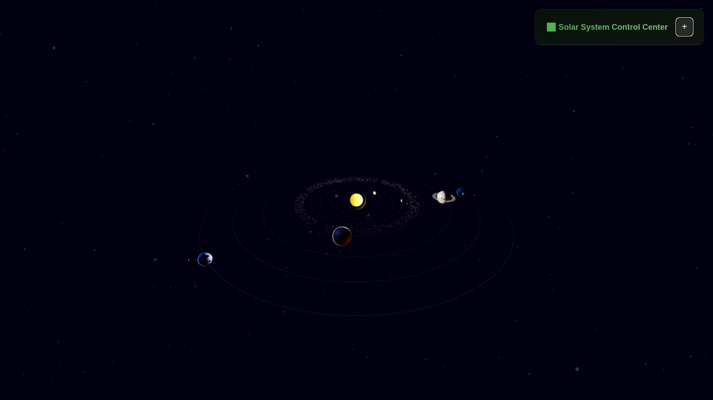

# Enhanced 3D Solar System - Cinematic Edition

A stunning, movie-quality 3D solar system simulation featuring realistic planetary systems, moons, asteroid belts, comets, and advanced visual effects powered by Three.js.

### 🌙 Complete Moon Systems

- All moons orbit their parent planets with accurate relative speeds

### 🪨 Asteroid Belt

- **2,000+ asteroids** between Mars and Jupiter
- Realistic size and color variations

### ☄️ Comet System

- **5 comets** with highly elliptical orbits
- Particle-based comet tails

### 🎨 Cinematic Visual Effects

- **Enhanced Sun**: Animated surface with corona effects
- **Atmospheric Glow**: Gas giants have realistic atmospheric halos
- **Saturn's Rings**: Detailed ring system with proper tilt
- **Space Dust**: 5,000+ particle space dust system
- **Nebula Background**: Animated cosmic background
- **Advanced Lighting**: Multiple light sources with rim lighting
- **Enhanced Starfield**: 15,000+ stars with color variation and twinkling

### 🎮 Advanced Controls

- **Keyboard Controls**: WASD for camera movement, Space for pause, R for reset
- **Quality Settings**: Performance/Balanced/Quality/Cinematic modes
- **Visual Toggles**: Show/hide moons, asteroids, comets, atmosphere, particles
- **Enhanced UI**: Modern, responsive control panel with statistics
- **Object Focus**: Click any celestial body to focus and get detailed information

## 🚀 Technical Enhancements

### 🎬 Cinematic Rendering

- **Advanced Materials**: Phong shading with specular highlights
- **Dynamic Shadows**: High-resolution shadow mapping
- **Shader Effects**: Custom shaders for sun, atmosphere, and effects
- **Tone Mapping**: ACES Filmic tone mapping for realistic colors
- **Anti-aliasing**: High-quality anti-aliasing for smooth edges

### ⚡ Performance Optimization

- **Quality Levels**: Adaptive quality settings for different hardware
- **LOD System**: Level-of-detail for distant objects
- **Efficient Rendering**: Optimized geometry and materials
- **FPS Monitoring**: Real-time performance tracking

### 📱 Enhanced Mobile Support

- **Touch Controls**: Optimized for mobile devices
- **Responsive UI**: Adaptive interface for all screen sizes
- **Performance Scaling**: Automatic quality adjustment for mobile

## 🎯 Installation & Setup

- No installation is needed, it runs in browser.
- Just run the index.html file.

## 🎮 Enhanced Controls Guide

### 🖱️ Mouse Controls

- **Drag**: Rotate camera around solar system
- **Scroll**: Zoom in/out (20-300 units)
- **Click Object**: Focus camera and show detailed information
- **Hover**: Show tooltip with basic information

### ⌨️ Keyboard Controls

- **WASD**: Fly camera (W/S: up/down, A/D: left/right)
- **Space**: Pause/Resume animation
- **R**: Reset camera to default position

### 🎛️ UI Panel Controls

- **Global Speed**: 0-5x animation speed multiplier
- **Camera Distance**: Manual zoom control
- **Planet Speeds**: Individual speed control for each planet (0-10x)
- **Visual Toggles**: Show/hide different object types
- **Quality Settings**: Performance optimization levels

## 🌌 Celestial Objects

### ⭐ Central Star

### 🪐 Planets (8 total)

### 🌙 Moons (15 total)

### 🪨 Other Objects

## 🎨 Visual Quality Levels

### 💻 Performance Mode

### ⚖️ Balanced Mode

### ✨ Quality Mode (Default)

### 🎬 Cinematic Mode

## 🛠️ Technical Specifications

### 🎮 Rendering Engine

- **Three.js**: Latest WebGL 2.0 features
- **Shader Programming**: Custom GLSL shaders
- **Physics**: Realistic orbital mechanics
- **Lighting**: Advanced multi-light setup

### 📱 Compatibility

- **Desktop**: Chrome, Firefox, Safari, Edge
- **Mobile**: iOS Safari, Chrome Mobile
- **WebGL**: Requires WebGL 2.0 support
- **Performance**: Adaptive quality scaling

### 🔧 Customization Options

- Modify planet data in \`enhanced-script.js\`
- Adjust visual effects in shader code
- Customize UI styling in \`styles.css\`
- Add new celestial objects easily

## 🚀 Performance Tips

### 🎯 Optimization

- Use Performance mode on older devices
- Close other browser tabs for better performance
- Reduce particle effects if experiencing lag
- Lower camera distance for better frame rates

### 📱 Mobile Optimization

- Automatic quality detection
- Touch-optimized controls
- Reduced particle density
- Efficient memory management

## 📄 License

This enhanced solar system simulation is open source and available under the MIT License.

## 🙏 Credits

- **Three.js**: 3D graphics library
- **NASA**: Astronomical data and inspiration
- **ESA**: European Space Agency data
- **Community**: Open source contributors

---

**Experience the cosmos like never before with this cinematic-quality 3D solar system simulation!** 🌌✨
